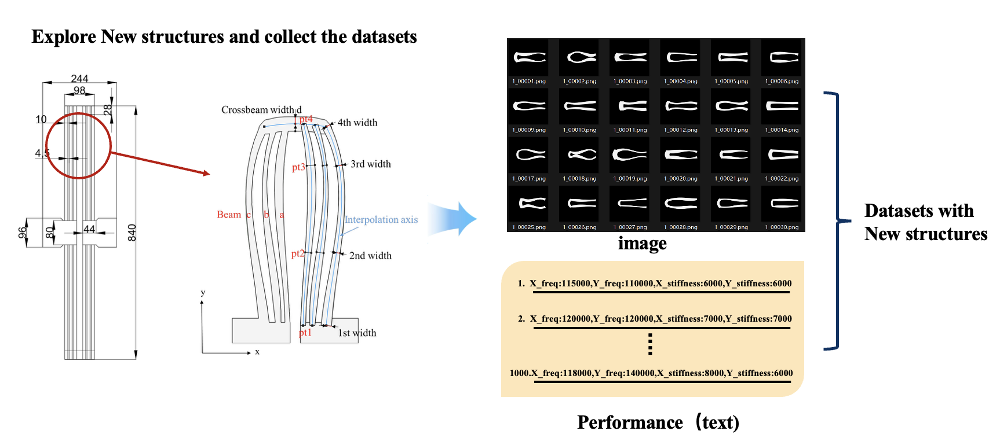
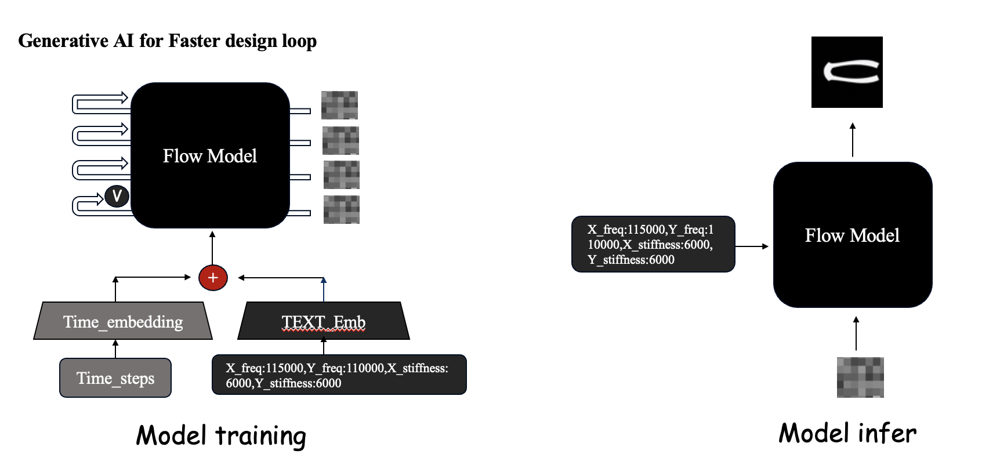

# Perf2Struct

**⚡️Performance-Conditioned Structural Generation for Fork-Shaped Beam Design**

Perf2Struct is a generative inverse design project for fork-shaped beam structures.  
Its goal is to generate structural geometries from target mechanical performance indicators and validate the generated results through simulation-oriented engineering post-processing.

## Project Overview



*Figure 1. Overall data pipeline.*



*Figure 2. Model structure.*

## Overview

This project explores how to map target structural properties to 2D fork-shaped beam geometries using conditional generative modeling.

The current workflow includes:

1. performance-conditioned structure generation
2. image-based geometry output
3. contour extraction and geometric fitting
4. COMSOL-based reconstruction and validation

## Target Conditions

The model is conditioned on mechanical performance indicators such as:

- drive frequency
- w/ split + w/o split
- parasitic mode
- x stiffness
- nonlinearity

## Project Goal

The main objective is not only to generate visually plausible structures, but also to produce candidate geometries that can serve as effective starting points for downstream simulation and optimization.

In other words, the generated image is treated as an initial design proposal, while the final performance is verified after geometric reconstruction and simulation in COMSOL.

## Method

The current research direction includes:

- conditional flow matching for structural image generation
- structured condition encoding instead of generic text encoding
- geometry reconstruction from pixel outputs
- simulation validation in COMSOL

## 🛠️ Installation
```bash
conda activate -n perf2struct python==3.8.20
conda activate perf2struct
pip install -r requirements.txt
```

## Data Preprocess

You should first generate paired data `(image, text/performance)` using COMSOL and MATLAB, and organize the dataset in the following format:

```text
dataset/
├── png/
│   ├── 0001.png
│   ├── 0002.png
│   └── ...
└── jsonl/
    └── labels.jsonl
```
Then run:
```bash
cd data_preprocess/
python wo_splt_text.py
python pipeline_feature.py
```

## train and eval

Train:
```bash
 python scripts/t2i_feature.py
```

Eval:
you should use comsol and matlab to compute the performance of the output images.
when you get the performance of your output and keep the format like the traing data josnl. 
then for the metircs of your model, you can compare the differences between the performance of your output and the real label. run:
```bash
python metrics.py
```


